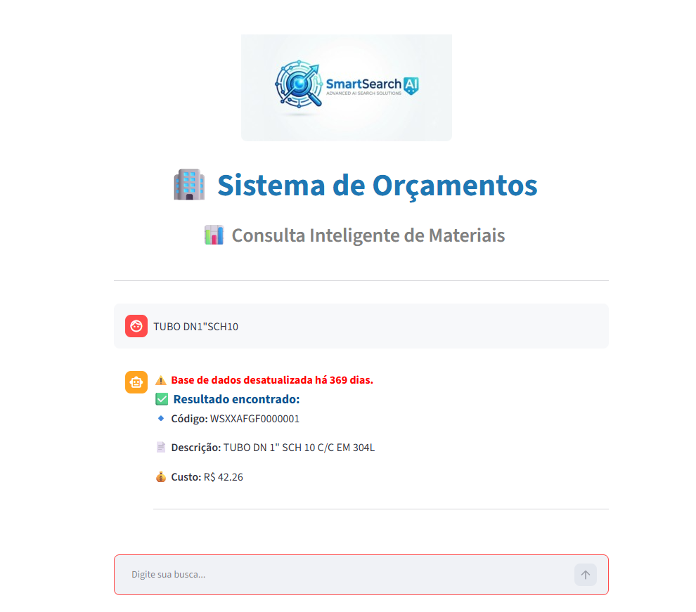
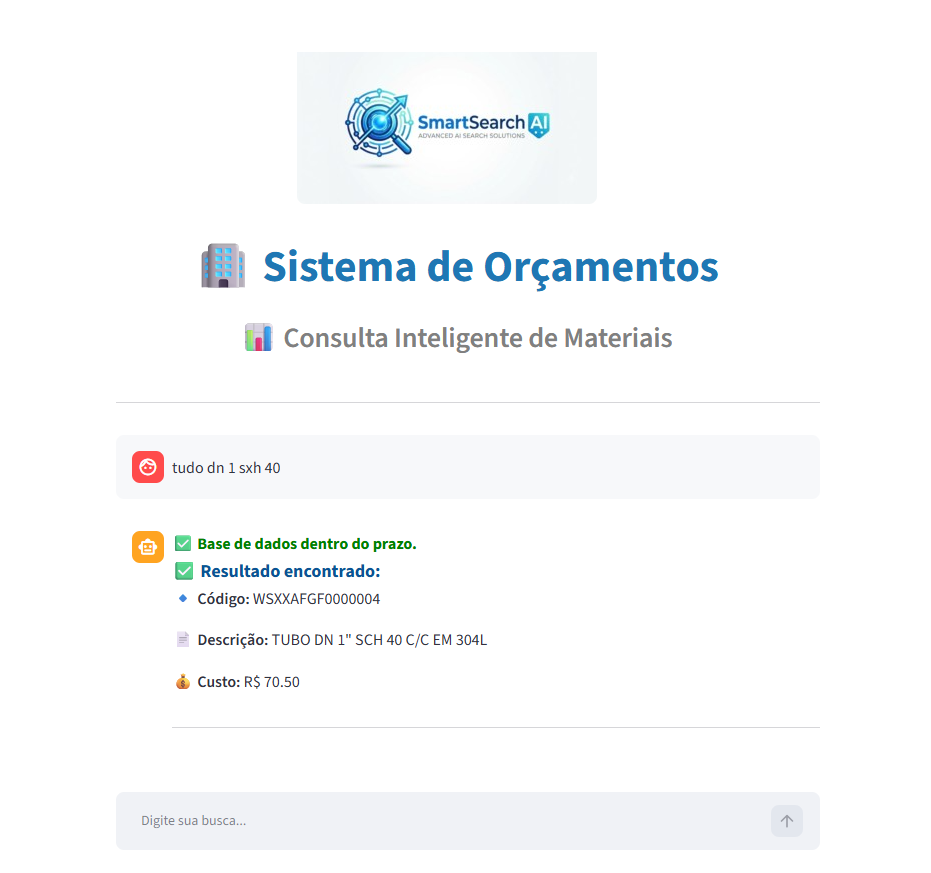
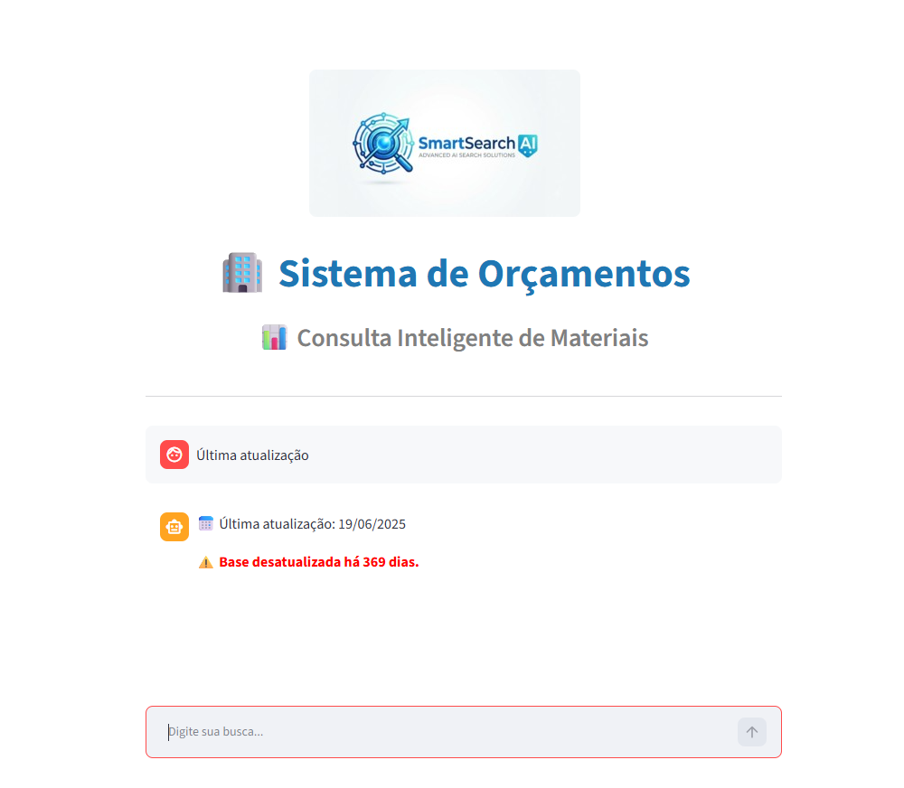
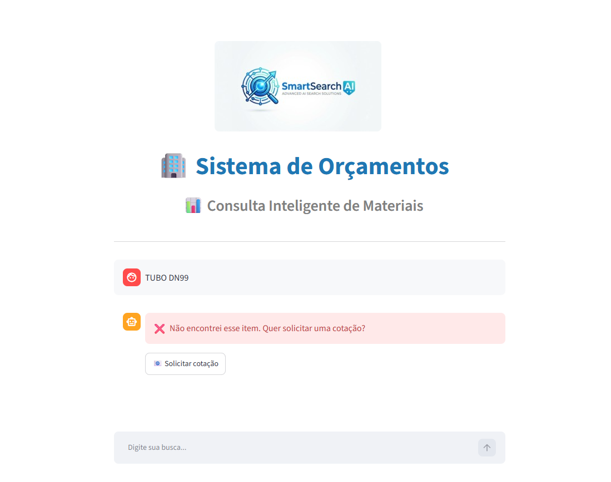

# 🏢 Sistema de Consulta Inteligente de Materiais

Este projeto é um sistema desenvolvido em Python com Streamlit para consulta inteligente de produtos, focado em uso corporativo para áreas de orçamento e compras.

## 📸 Demonstração

### 🔍 Busca de produto

### 🤖 Correção inteligente

### ⚠️ Alerta de base

### 📧 Solicitação de cotação

## 🚀 Funcionalidades

✅ Busca inteligente de produtos  
✅ Correção automática de erros de digitação  
✅ Interpretação de entradas complexas (ex: `dn1sch40`)  
✅ Filtros por:
    - DN (diâmetro)
    - SCH (espessura)
    - Material (304 / 316)

✅ Busca direta por código de produto  
✅ Verificação automática de atualização da base de dados  
✅ Alerta visual quando a base está desatualizada  
✅ Interface tipo chat
✅ Geração automática de e-mail para solicitação de cotação  

## 🧠 Inteligência do sistema

O sistema interpreta entradas do usuário mesmo com erros, por exemplo:

| Entrada do usuário | Interpretação |
|------------------|--------------|
| `tuo dn1sch40` | TUBO DN 1 SCH 40 |
| `tudo dn 1 sxh 40` | TUBO DN 1 SCH 40 |
| `dn1sch40` | DN 1 SCH 40 |

## 📦 Tratamento de dados

- Leitura de dados via CSV
- Normalização de texto
- Regex para tratamento de padrões (DN/SCH)
- Remoção de inconsistências na base
- Comparação inteligente para evitar erros

## 📊 Interface

Desenvolvida com Streamlit:

- Layout com identidade visual personalizada
- Chat interativo
- Respostas formatadas
- Destaque visual de status da base:
  - 🔴 Desatualizada
  - 🟢 Dentro do prazo

## 📧 Integração com e-mail

Permite gerar automaticamente uma solicitação de cotação via Outlook:

- Destinatário automático
- CC configurável
- Assunto e corpo preenchidos
- Integração com Outlook

## 🛠 Tecnologias utilizadas

- Python
- Streamlit
- Pandas
- Regex (re)
- Difflib (correção de palavras)

## 💡 Possíveis melhorias futuras

- 📄 Exportação de orçamento (PDF/Excel)
- 🏆 Destaque automático do melhor preço
- 📈 Dashboard de atualização da base

## 👩‍💻 Autoria

Desenvolvido por **Larissa da Silva Barros**  
Área de Engenharia / Orçamentos

